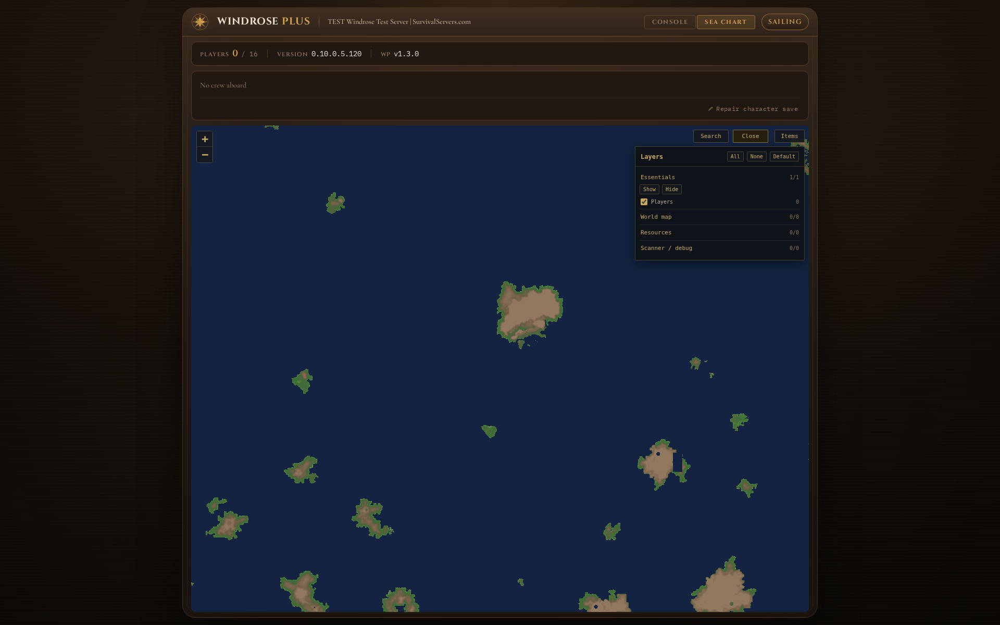
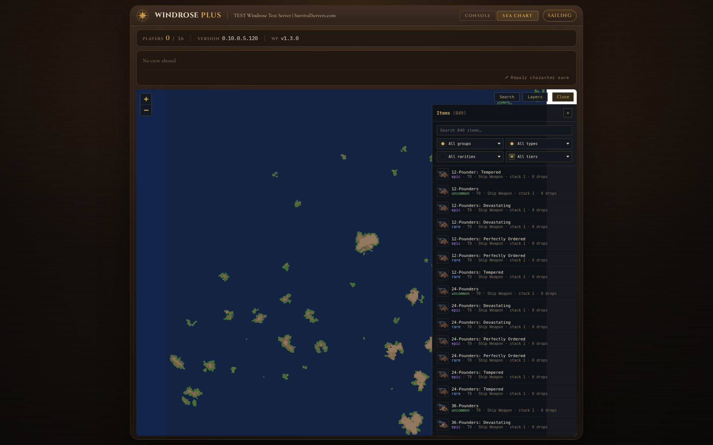
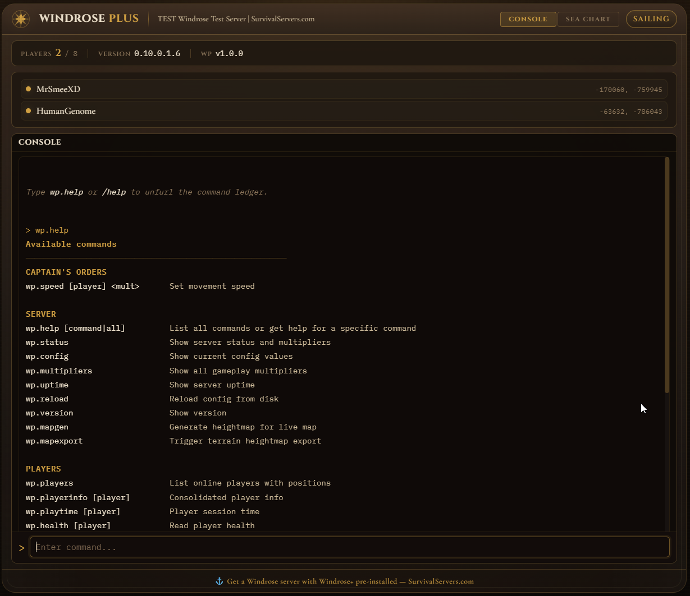

<p align="center">
  <picture>
    <source media="(prefers-color-scheme: dark)" srcset="docs/brand/windroseplus-landscape-dark.png">
    
  </picture>
</p>

# Windrose+

[](LICENSE)
[](https://github.com/UE4SS-RE/RE-UE4SS)
[](https://store.steampowered.com/app/3041230/)
[](#features)

Everything your Windrose dedicated server is missing: multipliers, a live map, an admin console, server browser support, and mod support. Server-side only, no client mods required.

_Windrose+ is a community project and is not affiliated with or endorsed by the developers of Windrose._

> **Official Hosting:** [SurvivalServers.com](https://www.survivalservers.com/services/game_servers/windrose/?utm_source=github&utm_medium=readme&utm_campaign=windrose_plus) offers Windrose servers with Windrose+ pre-installed.

---

## Table of Contents

- [Features](#features)
- [Installation](#installation)
- [Using Windrose+](#using-windrose)
- [Integrations](#integrations)
- [Contributing](#contributing)
- [License](#license)

---

## Features

### Live Sea Chart
A real-time map of your server showing island terrain, player and creature positions, POI/layout overlays when available, resource-zone hints, and a searchable 840-item catalog. Item detail pages include rarity, tier, stack, crafting recipes, vendor trades, construction uses, drop-source table IDs, and map links for sources that match known POI markers.



The Items panel browses the bundled 840-item catalog with group/type/rarity/tier filters and click-through to recipes, vendor trades, and map source hits.



### Admin Console (RCON)
Run commands from a web dashboard with autocomplete. Check who's online, view server stats, monitor performance, and manage your server remotely. 30+ built-in commands out of the box.



### Server Query
Windrose dedicated servers don't respond to standard server queries, so your server won't show player counts or status to external tools. Windrose+ adds a query responder so server browsers and monitoring tools can see your server.

```json
{
  "server": {
    "name": "My Windrose Server",
    "version": "0.10.0.5.120",
    "windrose_plus": "1.3.4",
    "password_protected": false,
    "max_players": 10,
    "player_count": 3
  },
  "players": [
    { "name": "HumanGenome", "alive": true, "x": 14520, "y": -8340 },
    { "name": "CaptainMorgan", "alive": true, "x": 6200, "y": 1100 }
  ],
  "multipliers": {
    "xp": 3.0, "loot": 2.0,
    "craft_efficiency": 2.0, "cooking_speed": 2.0, "harvest_yield": 2.0
  }
}
```

### 2,400+ Server Settings & Multipliers
Adjust XP, loot, crafting costs, cooking/smelting speed, harvest yield, and more through a simple JSON file. Go deeper with 2,400+ individual INI settings for player stats, weapons, food effects, creature stats, co-op scaling, swimming, and rest bonuses.

**Active multipliers** (`windrose_plus.json`):
```json
{
  "xp": 3.0,
  "loot": 2.0,
  "craft_efficiency": 2.0,
  "cooking_speed": 2.0,
  "harvest_yield": 2.0
}
```

**Player Stats** (`windrose_plus.ini`):
```ini
[PlayerStats]
MaxHealth = 320
MaxStamina = 150
StaminaRegRate = 40
MaxPosture = 40
Armor = 0
MaxWeight = 99999
```

**Food Effects** (`windrose_plus.food.ini`):
```ini
[Food_Drink]
Food_Drink_Coffee_T03_Duration = 1800
Food_Drink_Coffee_T03_Endurance = 20
Food_Drink_Coffee_T03_MaxHealth = 160
Food_Drink_Coffee_T03_Mobility = 20

[Alchemy_Potions]
Alchemy_Potion_Healing_Base_HealthRestoreRatio = 0.35
Alchemy_Potion_Healing_Great_HealthRestoreRatio = 0.8
```

#### Multiplier PAK safety

A handful of multiplier keys are disabled, a few more are gated behind explicit opt-in, and there's a safe path for recovery if a PAK ever causes trouble.

- **Disabled keys.** `points_per_level`, `stack_size`, `weight`, `inventory_size`, and `crop_speed` are parsed for backward compatibility but no longer write PAK changes — they were disabled after crash reports from the character, inventory, and crop validators. `wp.givestats` records an audit note only and does not change a character in-game.
- **Save-state risk.** `inventory_size`, `stack_size`, `weight`, and other inventory-affecting PAK edits can become part of player save state once a character logs in. Take an out-of-band save backup before enabling them. Windrose+ refuses to build these high-risk multiplier PAKs when another installed PAK also edits inventory assets and removes the existing generated multiplier PAK on that failure, unless `WINDROSEPLUS_ALLOW_PAK_CONFLICTS=1` is set.
- **Emergency multiplier-PAK disable.** Set `WINDROSEPLUS_DISABLE_MULTIPLIER_PAK=1` before `StartWindrosePlusServer.bat`. The wrapper removes/skips `R5\Content\Paks\WindrosePlus_Multipliers_P.pak` and `windrose_plus_data\.windroseplus_multiplier_history.json` while keeping the dashboard, RCON, Sea Chart, mods loader, and CurveTable PAKs available. Non-default values in `windrose_plus.json` / `windrose_plus.harvest.ini` will not apply until the env var is removed and the server is started through the wrapper again.
- **Full recovery / disable.** Stop the server, rename `R5\Binaries\Win64\dwmapi.dll`, delete or move both generated PAKs (`WindrosePlus_Multipliers_P.pak` and `WindrosePlus_CurveTables_P.pak`), then delete `windrose_plus_data\.windroseplus_build.hash`. Removing settings from `windrose_plus.json` alone is not enough because UE4SS and existing PAK overrides can still load. Restore a save backup from before the inventory-affecting PAK change, confirm the character can join, then re-enable PAK overrides one at a time.

### Mod Support
Drop a Lua script into the `Mods/` folder and it loads automatically. Add custom commands, scheduled tasks, and player join/leave hooks. Changes hot-reload without restarting the server.

**For modders** — full API reference, manifest format, and examples are in [docs/scripting-guide.md](docs/scripting-guide.md). Admin command list: [docs/commands.md](docs/commands.md). Config keys: [docs/config-reference.md](docs/config-reference.md). Server-side storage hook notes: [docs/storage-hook-research.md](docs/storage-hook-research.md).

Ships with an example mod:

```lua
-- example-welcome/init.lua
local API = WindrosePlus.API

API.onPlayerJoin(function(player)
    API.log("info", "Welcome", player.name .. " joined the server")
end)

API.onPlayerLeave(function(player)
    API.log("info", "Welcome", player.name .. " left the server")
end)

API.registerCommand("wp.greet", function(args)
    local players = API.getPlayers()
    local names = {}
    for _, p in ipairs(players) do table.insert(names, p.name) end
    return "Ahoy, " .. table.concat(names, ", ") .. "!"
end, "Greet all online players")
```

### Server Activity Log
Windrose+ records server-side activity to `windrose_plus_data\logs\YYYY-MM-DD.log` for review and external tooling. Files are line-delimited JSON, append-only, and rolled daily — they survive server restarts and crashes.

Recorded events:

| `ev`                | Fires on                                              |
|---------------------|--------------------------------------------------------|
| `mod.boot`          | Windrose+ initializes (version, game dir, hook avail.) |
| `config.load`       | `windrose_plus.json` is loaded or reloaded             |
| `config.load.fail`  | Config parse fails — defaults are used                 |
| `player.join`       | A player connects                                      |
| `player.leave`      | A player disconnects                                   |
| `admin.command`     | Any `wp.*` command runs (caller, args, result, ms)     |
| `heartbeat`         | Every 5 minutes — uptime, mode, player count, config   |

Each line carries a fixed envelope: `ts` (UTC ISO-8601), `ts_unix`, `sid` (per-boot session id), `ev`, and `payload`. External tools (and mods, via `WindrosePlus.API.logEvent(ev, payload)`) can tail the current day's file or read past days for replay.

Quick queries with `jq`:

```bash
# What multipliers were active during the corruption window?
jq 'select(.ev=="heartbeat") | {ts, mult: .payload.multipliers}' logs/2026-04-27.log

# Who ran which admin commands?
jq 'select(.ev=="admin.command") | {ts, admin_user, command, status}' logs/2026-04-27.log
```

## Installation

You need a Windrose Dedicated Server already set up on Windows. If you do not have one yet, you can start with [SurvivalServers.com Windrose hosting](https://www.survivalservers.com/services/game_servers/windrose/?utm_source=github&utm_medium=readme_install&utm_campaign=windrose_plus) with Windrose+ pre-installed, or install the official Windrose Dedicated Server tool yourself and extract Windrose+ into that server folder.

### Step 1: Download and Install

1. Download the latest release from [GitHub Releases](https://github.com/HumanGenome/WindrosePlus/releases/latest).
2. Extract the zip into your Windrose Dedicated Server folder (e.g. `C:\WindroseServer\`).
3. Open PowerShell in that folder and run:

```powershell
.\install.ps1
```

This downloads UE4SS, installs the mod, and sets up the dashboard. Reinstalling is safe, your custom configs and mods are preserved.

### Step 2: Start Your Server

Edits to `multipliers` in `windrose_plus.json` or to any `.ini` file need to be baked into a game override PAK before the server launches — otherwise the game loads the unmodified defaults. That rebuild step is what `tools/WindrosePlus-BuildPak.ps1` does.

**The easy way:** run `StartWindrosePlusServer.bat` (installed at your server root). It runs the rebuild step if anything changed (no-op in milliseconds otherwise), then launches `WindroseServer.exe`.

If you need to recover from a bad PAK or test without multipliers, see [Multiplier PAK safety](#multiplier-pak-safety).

**If you already have your own launcher**, add one line before whatever calls `WindroseServer.exe`:

```powershell
powershell -NoProfile -ExecutionPolicy Bypass -File "<gameDir>\windrose_plus\tools\WindrosePlus-BuildPak.ps1" -ServerDir "<gameDir>" -RemoveStalePak
```

Non-zero exit means the build failed — don't launch the game.

Windrose+ loads automatically either way.

> **Note:** You must **Run as Administrator** when starting the server. Windrose+ uses a proxy DLL (UE4SS) that requires elevated permissions to load.

To start the web dashboard, open a second terminal in your game server folder and run:

```powershell
windrose_plus\start_dashboard.bat
```

The dashboard URL and RCON password are shown in the console. On first run, a `windrose_plus.json` config file is created with defaults.

By default the dashboard listens on all interfaces when PowerShell is elevated, then falls back to localhost if Windows blocks the wildcard listener. Multi-IP hosts can bind it to one address:

```powershell
windrose_plus\start_dashboard.bat -BindIp 192.0.2.10
```

You can also set `"server": { "bind_ip": "192.0.2.10" }` in `windrose_plus.json`.

---

## Using Windrose+

### Configuring Your Server

Windrose+ has two config files:

- **`windrose_plus.json`** (basic): multipliers, RCON password, admin Steam IDs, feature flags. Created automatically on first launch. Edit this for everyday changes.
- **`windrose_plus.ini`** (advanced): player base stats, weapon damage, food effects, creature stats, talents, combat tuning. Optional — copy `windrose_plus\config\windrose_plus.default.ini` to `windrose_plus.ini` if you want to customize.

Example `windrose_plus.json`:

```json
{
    "multipliers": {
        "loot": 2.0,
        "xp": 3.0,
        "craft_efficiency": 2.0,
        "cooking_speed": 2.0,
        "harvest_yield": 2.0
    },
    "rcon": {
        "enabled": true,
        "password": "your-password-here"
    },
    "server": {
        "http_port": 8780,
        "bind_ip": ""
    },
    "livemap": {
        "public": {
            "enabled": false,
            "token": ""
        }
    }
}
```

Multiplier and `.ini` edits need the override PAK rebuilt before the next launch — see [Step 2](#step-2-start-your-server) for the rebuild command (`StartWindrosePlusServer.bat` handles it for you). RCON password, admin IDs, and feature flags are read live and take effect without a rebuild.

See [docs/config-reference.md](docs/config-reference.md) for every advanced INI setting.

### Dashboard

Open the dashboard in your browser to manage your server. It includes a command console with autocomplete and a live Sea Chart showing terrain, players, mobs, layout overlays, resource-zone hints, and item drop sources in real time.

If you want friends to see the Sea Chart without the dashboard password, enable the optional map-only view:

```json
{
  "livemap": {
    "public": {
      "enabled": true,
      "token": "optional-share-token"
    }
  }
}
```

Then share `/public-map` or `/public-map?token=optional-share-token`. This exposes only the map view, public map data, tiles, layout overlays, and catalog assets; the console, config, and admin APIs still require the dashboard login.

Sea Chart can also render optional runtime save overlays when another local tool writes `windrose_plus_data/runtime_overlay.json`. That file is intentionally separate from the dashboard core: if it is absent, the map still loads terrain, players, layout overlays, resources, and item data normally; if present, `/api/runtime-overlay` and the token-gated public map path render chest state, buildings, saved player positions, fog reveal, and quest blackboard layers from the same JSON schema.

### Commands

Type `wp.help` in the console to see all available commands. Common ones:

| Command | What it does |
|---------|-------------|
| `wp.status` | Server info and active multipliers |
| `wp.players` | Who's online and where |
| `wp.config` | Current settings |
| `wp.creatures` | What's spawned on the map |
| `wp.memory` | Server memory usage |
| `wp.doctor` | Support snapshot and config warnings |

Full reference: [docs/commands.md](docs/commands.md)

### Advanced: INI Settings

For fine-grained control beyond multipliers, Windrose+ supports 2,400+ individual settings across player stats, weapons, food, gear, and creatures.

Copy any `.default.ini` from the `config/` folder, rename it (drop `.default`), and edit only the values you want to change. Full reference: [docs/config-reference.md](docs/config-reference.md)

Type-specific files such as `windrose_plus.food.ini` and `windrose_plus.weapons.ini` can be used without creating a root `windrose_plus.ini`. `StartWindrosePlusServer.bat` includes those files in the rebuild hash, so edits trigger a new PAK build on the next launch.

### Mods

Windrose+ supports custom Lua mods. Drop a folder into `WindrosePlus/Mods/` with a `mod.json` and your script. It hot-reloads automatically.

See [docs/scripting-guide.md](docs/scripting-guide.md) for the API and examples.

---

<details>
<summary><strong>Troubleshooting</strong></summary>

- **Server crashes on startup** - Check `UE4SS-settings.ini`. The current Windrose-safe defaults keep `HookProcessInternal = 1`, `HookEngineTick = 0`, `HookUObjectProcessEvent = 0`, and `DefaultExecuteInGameThreadMethod = EngineTick`. Older guidance to enable `HookEngineTick` or switch the dispatcher to `ProcessEvent` is no longer correct.
- **RCON not working** - Set a real password in `windrose_plus.json` (not blank, not `changeme`).
- **Dashboard commands time out except `wp.help`** - Fully stop the game process and dashboard, then start them again. If you launched with `StartWindrosePlusServer.bat`, closing the console window can leave `WindroseServer-Win64-Shipping.exe` running in the background; stop it in Task Manager before relaunching.
- **No map data** - A player needs to connect at least once to trigger terrain export. If the Sea Chart still says "not ready", check `windrose_plus_data\map_generation_status.json`; it records whether tile generation is running, complete, or failed. The item catalog can load before terrain is ready, but "show on map" source links need the layout runtime cache.
- **Sea Chart layers say "Curated overlay not configured"** - The curated POI / quest / biome / marker / item-source layers come from an optional layout-runtime provider. The base map (terrain, players, your own POIScan output, item catalog) works without one. To enable the curated layers, point `server.layout_runtime_url` in `windrose_plus.json` (or `WINDROSEPLUS_LAYOUT_RUNTIME_URL`) at any compatible provider. The HTTP contract — GET, seeding POST, and response payload shape — is documented in [`docs/config-reference.md`](docs/config-reference.md#layout-runtime-provider-optional) so you can run your own.
- **CurveTable PAK fails with a retoc error** - Run `windrose_plus\tools\WindrosePlus-BuildPak.ps1 -ForceExtract` once so the cache is rebuilt and the full retoc error is shown. If the message mentions `ScriptObjects`, make sure you are on v1.0.14 or newer; older builds passed only one `.utoc` file to retoc instead of the full `R5\Content\Paks` folder.
- **Multiplier PAK / save issues / full recovery** - See [Multiplier PAK safety](#multiplier-pak-safety) for the disable env var, recovery steps, and save-backup guidance.

</details>

---

## Integrations

- [Windrose Server Manager](https://github.com/ManuelStaggl/WindroseServerManager) can install and manage Windrose+ from its Windows desktop UI. It fetches the latest Windrose+ release instead of bundling a stale copy.

---

## Contributing

See [CONTRIBUTING.md](CONTRIBUTING.md).

---

## Disclaimer

Windrose+ is a community project and is not affiliated with or endorsed by the developers of Windrose. Use at your own discretion and in accordance with the [Windrose EULA](https://playwindrose.com/eula/).

---

## License

MIT. See [LICENSE](LICENSE).

## Credits

- [UE4SS](https://github.com/UE4SS-RE/RE-UE4SS) - Unreal Engine scripting and modding framework
- [rxi/json.lua](https://github.com/rxi/json.lua) - Pure Lua JSON library (MIT)
